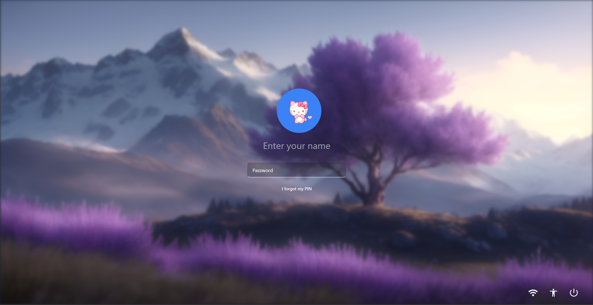
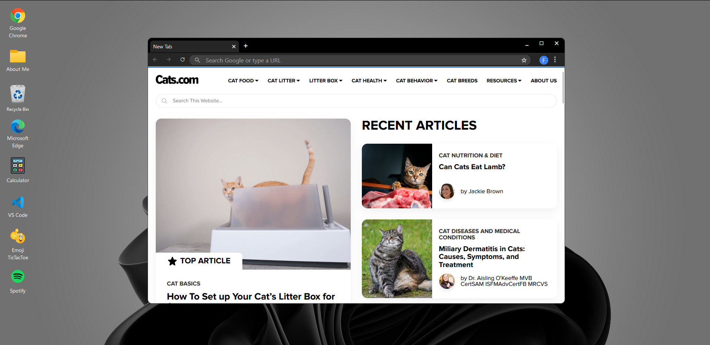
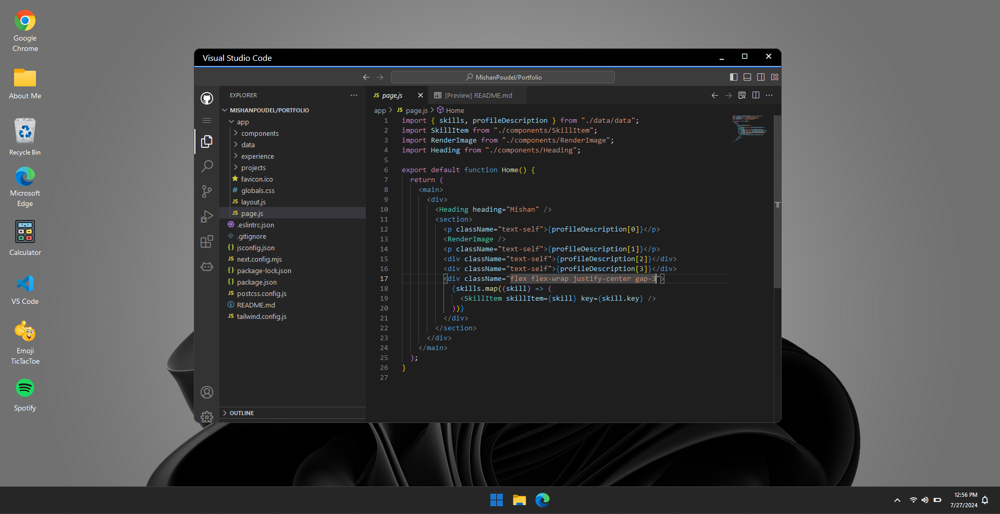
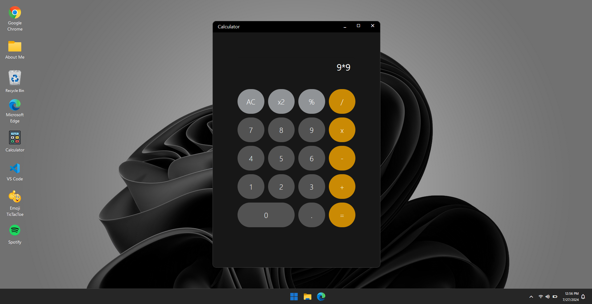
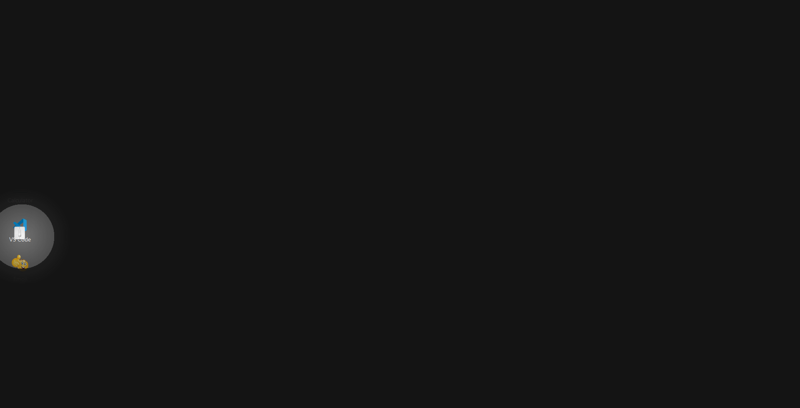
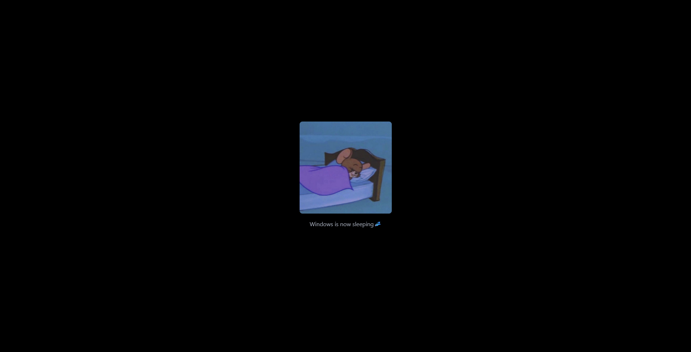
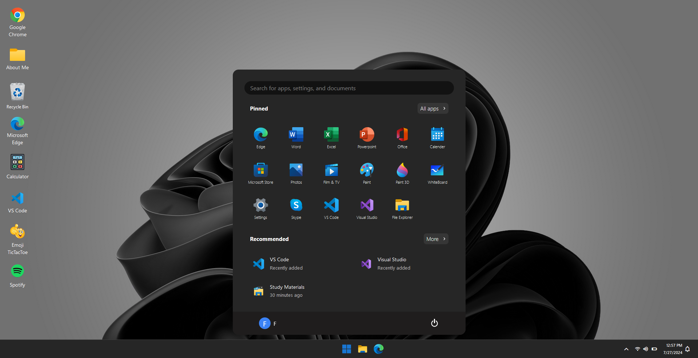

🖥️ Windows 11

Welcome to the **Windows Clone** app built with **React.js**! 🎉 Dive into this interactive simulation of the Windows operating system, packed with apps and features to play around with. Let’s get started!

    
    
    
<strong>You can enter anything on the login page to gain access to the app. No need for actual credentials!</strong>

## 🎨 Features
- **🌐 Chrome**: Surf the web just like in a real Chrome browser.
- **🧮 Calculator**: Perform basic arithmetic operations with this handy calculator.
- **💻 VS Code**: Virtual Visual Studio Code environment.
- **🕹️ Tic-Tac-Toe**: Play a fun game of Tic-Tac-Toe !
- **🎵 Spotify**: Enjoy a simulated music player interface.
- **📁 About Me**: Learn about ME.

## **Login Page**
- You can enter anything on the login page to gain access to the app. No need for actual credentials! 🔐
- Click on the icons on the desktop to open the different apps.
- Use the taskbar to switch between open applications.
- Interact with the apps to explore their features and functionalities!

## 📸 Screenshots

    
    
    
    
    
    
    
    

## 💡 Inspiration

 

This project was slightly inspired by [Vivek Patel's portfolio](https://vivek9patel.github.io/). Check it out for more creative ideas and inspiration!
